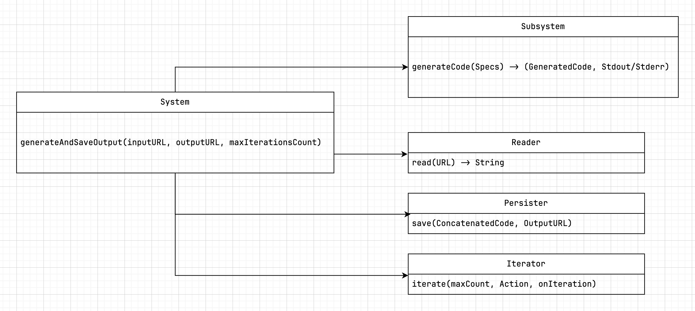

# Tddbudy

This is an experiment in AI-assisted test-driven development.

### User Stories

- As a developer, I want to write unit tests without writing any SUT code, so the AI can generate the implementation for me. *(The SUT is defined implicitly by the assertion; the AI infers the intended behavior.)*
- As a developer, I want the tool to automatically retry code generation when the AI produces non-compiling code or failing tests.
- As a developer, I want to configure a maximum number of retries per prompt to avoid infinite loops.
- As a developer, I want to see the build output and test results after each generation attempt.
- As a developer, I want a lightweight CLI that I can run locally.
- As a developer, I want the tool to be model-agnostic — compatible with OpenAI, Mistral, LLaMA, or any other provider.
- As a developer, I want each generation attempt archived (prompt, AI response, result) for traceability and debugging.

### Desired Behavior

The CLI should accept the following inputs:

- A `specs.swift` file containing the test cases.
- An output filename for the generated implementation.
- A maximum number of allowed iterations (for retrying failed generations).

### Proposed System Flow:


```
System.generateCodeFrom(specs) → (GeneratedCode, Stdout/Stderr)
    → LLM.send(specs) → GeneratedCode
    → Concatenator.concatenate(GeneratedCode, Specs) → Concatenated
    → CodeRunner.run(Concatenated) → Stdout/Stderr
    → Exit
```

More control is needed (input & output urls, max iteration count), so we'll probably need more components and a higher level coordinator:



### Usage

Define your specs in a swift folder without implementing the _sut_.

```swift
//specs.swift
func test_adder() {
    let sut = Adder(a: 1, b: 2)
    assert(sut.result == 3)
}
```

Pass the path of the file to _TestBuddy_:

```shell
tddbudy specs.swift specs-output.swift
```
Generated output file is created (generated implementation may vary):

```swift
/specs-output.swift
struct Adder {
  let a: Int
  let b: Int
  var result: Int { a + b}
}
```

